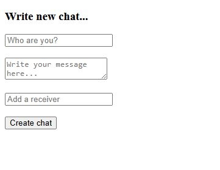
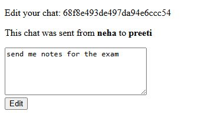

# 💬 **MongoChat CRUD App**

A simple **chat-based CRUD application** built using **Node.js**, **Express**, and **MongoDB (Mongoose)** — demonstrating *Create, Read, Update, and Delete* operations with **EJS templates**.  
Think of it as a *mini WhatsApp clone* for learning backend development fundamentals.

---

## 🚀 **Features**

- ✨ **Add new chats**
- 📖 **View all chats**
- 📝 **Edit existing messages**
- 🗑️ **Delete chats**
- 🧩 **MongoDB + Mongoose integration**
- 💡 **RESTful routes and EJS-based UI**

---

## 🧠 **Tech Stack**

| Layer | Technologies |
|-------|---------------|
| **Frontend** | EJS, CSS |
| **Backend** | Node.js, Express.js |
| **Database** | MongoDB with Mongoose |
| **Utilities** | Method-Override, Express Middleware |

---

## 📂 **Project Structure**

MongoChat-CRUD-App/
│
├── models/
│ └── chat.js
│
├── public/
│ └── style.css
│
├── views/
│ ├── index.ejs
│ ├── new.ejs
│ └── edit.ejs
│
├── init.js
├── index.js
├── package.json
└── package-lock.json


---

## ⚙️ **Installation & Setup**

### 1️⃣ **Clone the Repository**
```bash
git clone https://github.com/CodeByAlmas/MongoChat-CRUD-App.git
cd MongoChat-CRUD-App
```

### 2️⃣ Install Dependencies
npm install

### 3️⃣ Run MongoDB Server
Make sure MongoDB is running locally:

mongod

### 4️⃣ Start the App
node index.js

### 5️⃣ Visit in Browser
http://localhost:8080/chats

## 🖥️ **Screenshots**




## 📘 **Learning Highlights**

🧱 CRUD operations using MongoDB & Mongoose

🔄 RESTful routing with Express

🖋️ EJS templates for server-side rendering

✅ Schema validation and data modeling

🔗 Backend ↔ Frontend integration

## 👨‍💻 **Author**

Mohd Almas
Full Stack Developer (MERN Stack Learner)
📍 India

👨‍💻 [**Mohd Almas**](https://github.com/CodeByAlmas)
🔗 [**LinkedIn**](https://www.linkedin.com/in/mohd-almas-9ab9a6235/)
📧 Email: mohd2almas321@gmail.com

## ⭐ **Support**

If you found this project helpful, please ⭐ the repo — it helps others discover it too!
Thank you for checking it out ❤️